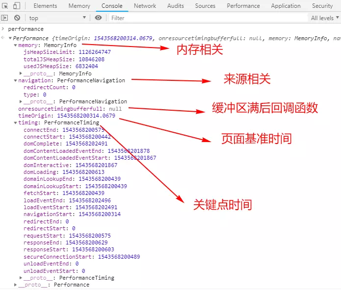
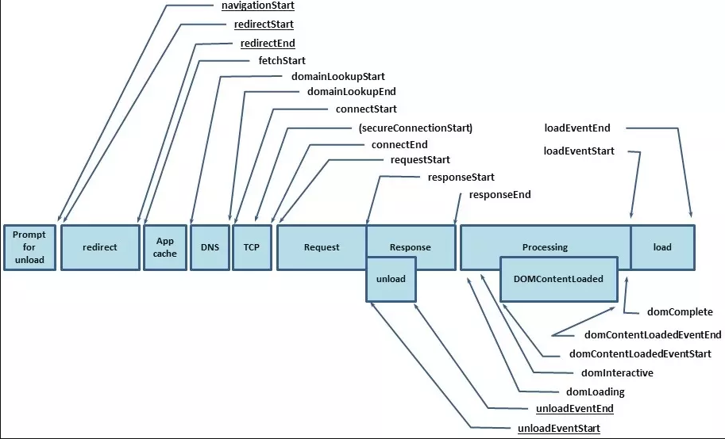
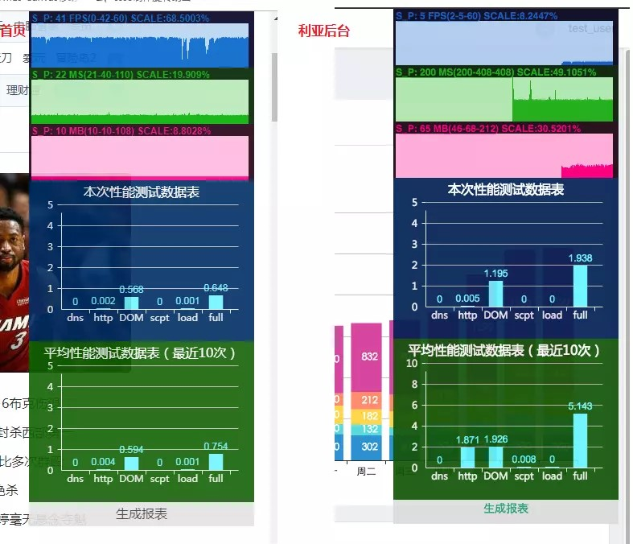
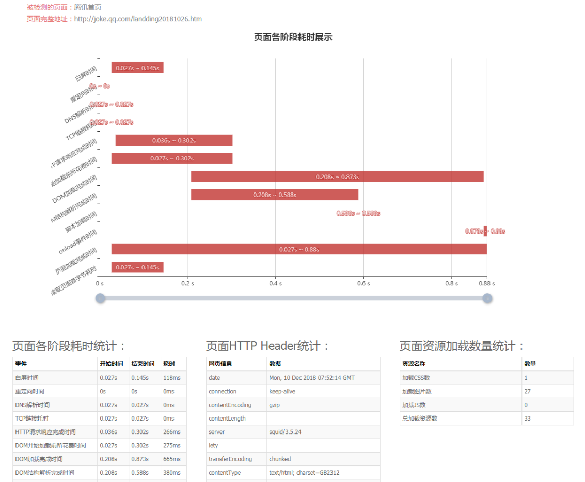

>使用performance优化前端 
>performance功能详解  

引用：[https://juejin.im/post/5caaacc0e51d452b45296487](https://juejin.im/post/5caaacc0e51d452b45296487)
## 深入理解前端性能监控

	在同样的网络环境下，有两个同样能满足你的需求的网站，一个唰的一下就加载出来了，另一个白屏转圈转了半天内容才出来，如果让你选择，你会用哪一个？

 页面的性能问题是前端开发中一个重要环节，但一直以来我们没有比较好的手段，来检测页面的性能。直到W3C性能小组引入的新的API window.performance，目前IE9以上的浏览器都支持。它是一个浏览器中用于记录页面加载和解析过程中关键时间点的对象。放置在global环境下，通过JavaScript可以访问到它。

### 使用性能API

你可以通过以下方法来探测和兼容performance：

	var performance = window.performance || 
	    window.msPerformance || 
	    window.webkitPerformance;
	if (performance) {
	    // 你的代码
	}

先来了解一下performance的结构：

performance.memory是显示此刻内存占用情况，它是一个动态值，其中： usedJSHeapSize表示：JS 对象（包括V8引擎内部对象）占用的内存数 totalJSHeapSize表示：可使用的内存 jsHeapSizeLimit表示：内存大小限制 通常，usedJSHeapSize不能大于totalJSHeapSize，如果大于，有可能出现了内存泄漏。

performance.navigation显示页面的来源信息，其中： redirectCount表示：如果有重定向的话，页面通过几次重定向跳转而来，默认为0 type表示页面打开的方式， 0 表示 TYPE_NAVIGATENEXT 正常进入的页面（非刷新、非重定向等） 1 表示 TYPE_RELOAD 通过 window.location.reload() 刷新的页面 2 表示 TYPE_BACK_FORWARD 通过浏览器的前进后退按钮进入的页面（历史记录） 255 表示 TYPE_UNDEFINED 非以上方式进入的页面

performance.onresourcetimingbufferfull 属性是一个在resourcetimingbufferfull事件触发时会被调用的 event handler 。它的值是一个手动设置的回调函数，这个回调函数会在浏览器的资源时间性能缓冲区满时执行。

performance.timeOrigin是一系列时间点的基准点，精确到万分之一毫秒。

performance.timing是一系列关键时间点，它包含了网络、解析等一系列的时间数据。

下面是对这些时间点进行解释

	timing: {
	        // 同一个浏览器上一个页面卸载(unload)结束时的时间戳。如果没有上一个页面，这个值会和fetchStart相同。  
		navigationStart: 1543806782096,
	
		// 上一个页面unload事件抛出时的时间戳。如果没有上一个页面，这个值会返回0。
		unloadEventStart: 1543806782523,
	
		// 和 unloadEventStart 相对应，unload事件处理完成时的时间戳。如果没有上一个页面,这个值会返回0。
		unloadEventEnd: 1543806782523,
	
		// 第一个HTTP重定向开始时的时间戳。如果没有重定向，或者重定向中的一个不同源，这个值会返回0。
		redirectStart: 0,
	
		// 最后一个HTTP重定向完成时（也就是说是HTTP响应的最后一个比特直接被收到的时间）的时间戳。
		// 如果没有重定向，或者重定向中的一个不同源，这个值会返回0. 
		redirectEnd: 0,
	
		// 浏览器准备好使用HTTP请求来获取(fetch)文档的时间戳。这个时间点会在检查任何应用缓存之前。
		fetchStart: 1543806782096,
	
		// DNS 域名查询开始的UNIX时间戳。
	        //如果使用了持续连接(persistent connection)，或者这个信息存储到了缓存或者本地资源上，这个值将和fetchStart一致。
		domainLookupStart: 1543806782096,
	
		// DNS 域名查询完成的时间.
		//如果使用了本地缓存（即无 DNS 查询）或持久连接，则与 fetchStart 值相等
		domainLookupEnd: 1543806782096,
	
		// HTTP（TCP） 域名查询结束的时间戳。
	        //如果使用了持续连接(persistent connection)，或者这个信息存储到了缓存或者本地资源上，这个值将和 fetchStart一致。
		connectStart: 1543806782099,
	
		// HTTP（TCP） 返回浏览器与服务器之间的连接建立时的时间戳。
	        // 如果建立的是持久连接，则返回值等同于fetchStart属性的值。连接建立指的是所有握手和认证过程全部结束。
		connectEnd: 1543806782227,
	
		// HTTPS 返回浏览器与服务器开始安全链接的握手时的时间戳。如果当前网页不要求安全连接，则返回0。
		secureConnectionStart: 1543806782162,
	
		// 返回浏览器向服务器发出HTTP请求时（或开始读取本地缓存时）的时间戳。
		requestStart: 1543806782241,
	
		// 返回浏览器从服务器收到（或从本地缓存读取）第一个字节时的时间戳。
	        //如果传输层在开始请求之后失败并且连接被重开，该属性将会被数制成新的请求的相对应的发起时间。
		responseStart: 1543806782516,
	
		// 返回浏览器从服务器收到（或从本地缓存读取，或从本地资源读取）最后一个字节时
	        //（如果在此之前HTTP连接已经关闭，则返回关闭时）的时间戳。
		responseEnd: 1543806782537,
	
		// 当前网页DOM结构开始解析时（即Document.readyState属性变为“loading”、相应的 readystatechange事件触发时）的时间戳。
		domLoading: 1543806782573,
	
		// 当前网页DOM结构结束解析、开始加载内嵌资源时（即Document.readyState属性变为“interactive”、相应的readystatechange事件触发时）的时间戳。
		domInteractive: 1543806783203,
	
		// 当解析器发送DOMContentLoaded 事件，即所有需要被执行的脚本已经被解析时的时间戳。
		domContentLoadedEventStart: 1543806783203,
	
		// 当所有需要立即执行的脚本已经被执行（不论执行顺序）时的时间戳。
		domContentLoadedEventEnd: 1543806783216,
	
		// 当前文档解析完成，即Document.readyState 变为 'complete'且相对应的readystatechange 被触发时的时间戳
		domComplete: 1543806783796,
	
		// load事件被发送时的时间戳。如果这个事件还未被发送，它的值将会是0。
		loadEventStart: 1543806783796,
	
		// 当load事件结束，即加载事件完成时的时间戳。如果这个事件还未被发送，或者尚未完成，它的值将会是0.
		loadEventEnd: 1543806783802
	}

这些参数非常有用，可以帮助我们获取页面的Domready时间、onload时间、白屏时间等，以及单个页面资源在从发送请求到获取到rsponse各阶段的性能参数。

对我们比较有用的页面性能数据大概包括如下几个，这些参数是通过上面的performance.timing各个属性的差值组成的，它是精确到毫秒的一个值，计算方法如下：

	重定向耗时：redirectEnd - redirectStart
	DNS查询耗时 ：domainLookupEnd - domainLookupStart
	TCP链接耗时 ：connectEnd - connectStart
	HTTP请求耗时 ：responseEnd - responseStart
	解析dom树耗时 ： domComplete - domInteractive
	白屏时间 ：responseStart - navigationStart
	DOMready时间 ：domContentLoadedEventEnd - navigationStart
	onload时间：loadEventEnd - navigationStart，也即是onload回调函数执行的时间。

如何优化？

**重定向优化：**重定向的类型分三种，301（永久重定向），302（临时重定向），304（Not Modified）。304是用来优化缓存，非常有用，而前两种应该尽可能的避免，凡是遇到需要重定向跳转代码的代码，可以把重定向之后的地址直接写到前端的html或JS中，可以减少客户端与服务端的通信过程，节省重定向耗时。

**DNS优化：**一般来说，在前端优化中与 DNS 有关的有两点： 一个是减少DNS的请求次数，另一个就是进行DNS预获取（Prefetching ） 。典型的一次DNS解析需要耗费 20-120 毫秒（移动端会更慢），减少DNS解析的次数是个很好的优化方式，尽量把各种资源放在一个cdn域名上。DNS Prefetching 是让具有此属性的域名不需要用户点击链接就在后台解析，而域名解析和内容载入是串行的网络操作，所以这个方式能减少用户的等待时间，提升用户体验 。新版的浏览器会对页面中和当前域名（正在浏览网页的域名）不在同一个域的域名进行预获取，并且缓存结果，这就是隐式的 DNS Prefetch。如果想对页面中没有出现的域进行预获取，那么就要使用显示的 DNS Prefetch 了。下图是DNS Prefetch的方法：

	<html>
	<head>
	  <title>腾讯网</title>
	  <link rel="dns-prefetch" href="//mat1.gtimg.com"  />
	  <link rel="dns-prefetch" href="//inews.gtimg.com"  />
	  <link rel="dns-prefetch" href="//wx.qlogo.cn"  />
	  <link rel="dns-prefetch" href="//coral.qq.com" />
	  <link rel="dns-prefetch" href="//pingjs.qq.com"  />

**TCP请求优化：**TCP的优化大都在服务器端，前端能做的就是尽量减少TCP的请求数，也就是减少HTTP的请求数量。http 1.0 默认使用短连接，也是TCP的短连接，也就是客户端和服务端每进行一次http操作，就建立一次连接，任务结束就中断连接。这个过程中有3次TCP请求握手和4次TCP请求释放。减少TCP请求的方式有两种，一种是资源合并，对于页面内的图片、css和js进行合并，减少请求量。另一种使用长链接，使用http1.1，在HTTP的响应头会加上 Connection:keep-alive，当一个网页打开完成之后，连接不会马上关闭，再次访问这个服务时，会继续使用这个长连接。这样就大大减少了TCP的握手次数和释放次数。或者使用Websocket进行通信，全程只需要建立一次TCP链接。

**HTTP请求优化：**使用内容分发网络（CDN）和减少请求。使用CDN可以减少网络的请求时延，CDN的域名不要和主站的域名一样，这样会防止访问CDN时还携带主站cookie的问题，对于网络请求，可以使用fetch发送无cookie的请求，减少http包的大小。也可以使用本地缓存策略，尽量减少对服务器数据的重复获取。

**渲染优化：**在浏览器端的渲染过程，如大型框架，vue和react，它的模板其实都是在浏览器端进行渲染的，不是直出的html，而是要走框架中相关的框架代码才能去渲染出页面，这个渲染过程对于首屏就有较大的损耗，白屏的时间会有所增加。在必要的情况下可以在服务端进行整个html的渲染，从而将整个html直出到我们的浏览器端，而非在浏览器端进行渲染。

还有一个问题就是，在默认情况下，JavaScript 执行会“阻止解析器”，当浏览器遇到一个 script 外链标记时，DOM 构建将暂停，会将控制权移交给 JavaScript 运行时，等脚本下载执行完毕，然后再继续构建 DOM。而且内联脚本始终会阻止解析器，除非编写额外代码来推迟它们的执行。我们可以把 script 外链加入到页面底部，也可以使用 defer 或 async 延迟执行。defer 和 async 的区别就是 defer 是有序的，代码的执行按在html中的先后顺序，而 async 是无序的，只要下载完毕就会立即执行。或者使用异步的编程方法，比如settimeout，也可以使用多线webworker，它们不会阻碍 DOM 的渲染。

	
	
	
	
	## 资源性能API
	performance.timing记录的是用于分析页面整体性能指标。如果要获取个别资源（例如JS、图片）的性能指标，就需要使用Resource Timing API。
	**performance.getEntries()**方法，包含了所有静态资源的数组列表；每一项是一个请求的相关参数有name，type，时间等等。下图是chrome显示腾讯网的相关资源列表。
	
	
	
	
	可以看到，与 performance.timing 对比： 没有与 DOM 相关的属性，新增了`name`、`entryType`、`initiatorType`和`duration`四个属性。它们是
	* name表示：资源名称，也是资源的绝对路径，可以通过performance.getEntriesByName（name属性的值），来获取这个资源加载的具体属性。
	* entryType表示：资源类型 "resource"，还有“navigation”, “mark”, 和 “measure”另外3种。
	
	    
	
	
	* initiatorType表示：请求来源 "link"，即表示<link> 标签，还有“script”即 <script>，“img”即标签，“css”比如background的url方式加载资源以及“redirect”即重定向 等。
	
	   
	
	
	* duration表示：加载时间，是一个毫秒数字。
	受同源策略影响，跨域资源获取到的时间点，通常为0，如果需要更详细准确的时间点，可以单独请求资源通过`performance.timing`获得。或者资源服务器开启响应头Timing-Allow-Origin，添加指定来源站点，如下所示：
Timing-Allow-Origin: qq.com

	## 方法集合
	除了`performance.getEntries`之外，`performance`还包含一系列有用的方法。如下图

		

	**performance.now()**
	`performance.now()` 返回一个当前页面执行的时间的时间戳，用来精确计算程序执行时间。与 `Date.now()` 不同的是，它使用了一个浮点数，返回了以毫秒为单位，小数点精确到微秒级别的时间，更加精准。并且不会受系统程序执行阻塞的影响，`performance.now()` 的时间是以恒定速率递增的，不受系统时间的影响（系统时间可被人为或软件调整）。`performance.timing.navigationStart + performance.now()` 约等于 `Date.now()`。

let t0 = window.performance.now(); doSomething(); let t1 = window.performance.now(); console.log("doSomething函数执行了" + (t1 - t0) + "毫秒.")

	 通过这个方法，我们可以用来测试某一段代码执行了多少时间。
	
	**performance.mark()**
	mark方法用来自定义添加标记时间。使用方法如下：
	复制代码
	var nameStart = 'markStart';
	var nameEnd   = 'markEnd';
	// 函数执行前做个标记
	window.performance.mark(nameStart);
	for (var i = 0; i < n; i++) {
	    doSomething
	}
	// 函数执行后再做个标记
	window.performance.mark(nameEnd);
	// 然后测量这个两个标记间的时间距离，并保存起来
	var name = 'myMeasure';
	window.performance.measure(name, nameStart, nameEnd);
	复制代码
	 保存后的值可以通过 **performance.getEntriesByname( 'myMeasure' )**或者 **performance.getEntriesByType**（'measure'）查询。
	
	**Performance.clearMeasures()**
	从浏览器的性能输入缓冲区中移除自定义添加的 measure
	
	**Performance.getEntriesByName()**
	返回一个 PerformanceEntry 对象的列表，基于给定的 name 和 entry type
	
	**Performance.getEntriesByType()**
	返回一个 PerformanceEntry 对象的列表，基于给定的 entry type
	
	**Performance.measure()**
	在浏览器的指定 start mark 和 end mark 间的性能输入缓冲区中创建一个指定名称的时间戳，见上例
	
	**Performance.toJSON()** 
	是一个 JSON 格式转化器，返回 Performance 对象的 JSON 对象

	## 资源缓冲区监控
	**Performance.setResourceTimingBufferSize()**
	设置当前页面可缓存的最大资源数据个数，entryType为resource的资源数据个数。超出时，会清空所有entryType为resource的资源数据。参数为整数(maxSize)。配合performance.onresourcetimingbufferfull事件可以有效监控资源缓冲区。当entryType为resource的资源数量超出设置值的时候会触发该事件。
	**Performance.clearResourceTimings()**
	从浏览器的性能数据缓冲区中移除所有的 entryType 是 "resource" 的 performance entries
	下面是mdn上关于这个属性的一个demo。这个demo的主要内容是当缓冲区内容满时，调用buffer_full函数。

function buffer_full(event) { console.log("WARNING: Resource Timing Buffer is FULL!"); performance.setResourceTimingBufferSize(200); } function init() { // Set a callback if the resource buffer becomes filled performance.onresourcetimingbufferfull = buffer_full; }

使用performance的这些属性和方法，能够准确的记录下我们想要的时间，再加上日志采集等功能的辅助，我们就能很容易的掌握自己网站的各项性能指标了。
### 兼容性
目前主流浏览器虽然都已支持performance对象，但是并不能支持它上面的全部属性和方法，有些细微的差别。本文主要依据chrome和qq浏览器测试了相关属性和方法，均可使用。

### 我们做了什么？（划重点）
现在的很多性能监控分析工具都是通过数据上报来实现的，不能及时有效的反馈页面的性能问题，只能在用户使用之后上报（问题出现之后）才能知道。所以基于新闻前端团队基于performance API做了一款实时查看性能的的工具，它并能给出详细的报表，在开发阶段把性能问题给解决掉。

superProfiler**【外部开源流程中】**

它是一款JavaScript性能监控工具库，通过脚本引用，加载展示在页面右侧，无须依赖任何库和脚本，可以实时查看当前页面的FPS、代码执行耗时、内存占用以及当前页面的网络性能，资源占用。

还能查看最近的（10次）页面性能的平均数。点击“生成报表”按钮会生成更详细的数据报表概览。

### 小结
Performance API 用来做前端性能监控非常有用，它提供了很多方便测试我们程序性能的接口。比如mark和measure。很多优秀的框架也用到了这个API进行测试。它里面就频繁用到了mark和measure来测试程序性能。所以想要开发高性能的web程序，了解Performace API还是非常重要的。最后通过superProfiler工具可以更快更便捷的查找出性能问题，针对性的击破问题，提高开发效率，提升用户体验。当然这只是前端性能优化的第一步，道阻且长。希望大家提出问题和指出疑问，一起进步。

作者：TNFE 大鹏哥
团队推广
最后，腾讯新闻TNFE前端团队为前端开发人员整理出了小程序以及web前端技术领域的最新优质内容，每周更新✨，欢迎star，github地址：github.com/Tnfe/TNFE-W…
